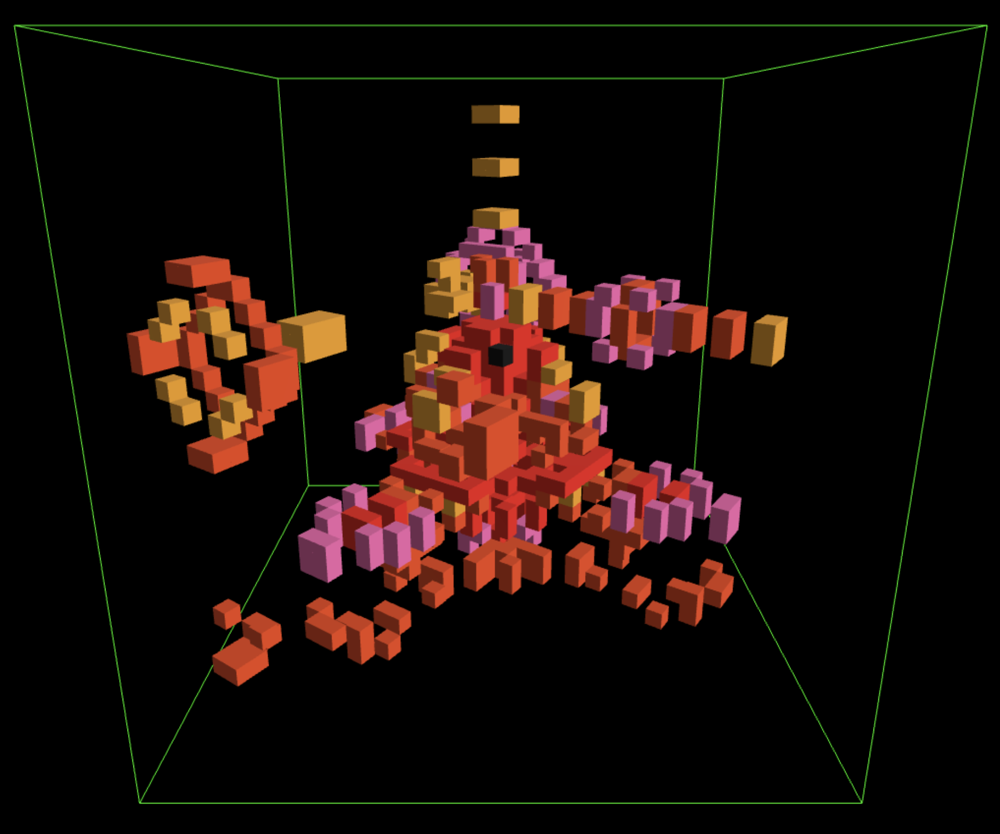

# Zellenraum3D: Electron App for 3D-Cellular-Automata Simulation
Zellenraum3D is a captivating 3D visualization of Cellular Automata, powered by Electron.js and THREE.js.
It provides a dynamic and interactive representation of evolving cellular structures.



Got inspired by the *Guru* of 3D Cellular Automata Visualization: [Softology](https://softologyblog.wordpress.com/2019/12/28/3d-cellular-automata-3/)

## Features

tbc.

## Start the Electron App
To run this application, make sure you have **Node.js** installed. Then, follow these steps:
1. Clone the repository to your local machine: ```git clone https://github.com/dangelic/Zellenraum3D.git```
2. Change directory: ```cd Zellenraum3D```
3. Install dependencies: ```npm i```
4. Start the Electron App in Dev Mode ```npm run dev```
